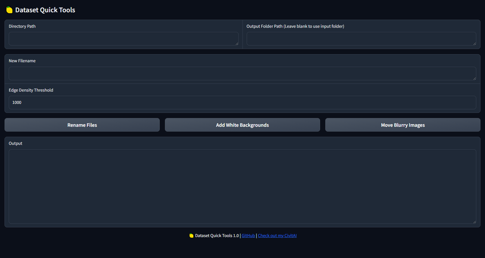

# 🍋 Dataset Quick Tools 1.0

A simple and efficient tool for quickly cleaning up datasets by applying basic transformations to images. This app provides 3 main features to help organize and refine your dataset:


### Preview:


### Features:
1. **Quick File Renaming**  
   Rename all files in a given directory by appending a specified word followed by an incrementing number, making it easy to standardize filenames for your dataset. This feature processes all files in the directory, preserving the original file extensions.

2. **Add White Backgrounds**  
   Add a solid white background to images with transparent backgrounds (e.g., PNG files with transparency). The app saves the processed images to a specified output folder. If no folder is specified, it saves the images back into the original input directory.

3. **Move Blurry Images**  
   Using the Canny edge detection algorithm, the app calculates the "edge density" of each image in the input directory. Images with low edge density (i.e., blurry images) are automatically moved to a separate "blurry" folder. You can set a threshold for the edge density to filter out the blurry images.

### Installation:
This app only uses standard Python Libraries, so there is no need to install any extra libraries.

1. Clone this repository:
   ```bash
   git clone https://github.com/citronlegacy/Dataset-Quick-Tools.git
2. Run the app:
   ```bash
   python Dataset_Quick_Tools.py

### Usage:

Once you launch the app, you will have the following input options:

- **Directory Path**: Specify the folder containing your dataset.
- **Output Folder Path**: Specify a folder where images with a white background should be saved. If left blank, the app will save the processed images in the same directory as the input images. Renamed image are never moved.
- **New Filename**: The word you want to prepend to all file names when renaming.
- **Edge Density Threshold**: A value for detecting blurry images. The default value is `1000`.

You can then trigger the following actions:

- **Rename Files**: Click to rename all files in the input directory, appending a specified word followed by an incrementing number.
- **Add White Backgrounds**: Click to add white backgrounds to transparent images.
- **Move Blurry Images**: Click to detect blurry images (based on edge density) and move them to a separate "blurry" folder.

### Example Workflow:
1. Set the **Directory Path** to the folder containing images.
2. Choose an **Output Folder Path** (or leave it blank to use the input folder).
3. Enter a **New Filename** to rename all files.
4. Set an **Edge Density Threshold** to filter blurry images.
5. Click on the buttons to perform the tasks.
